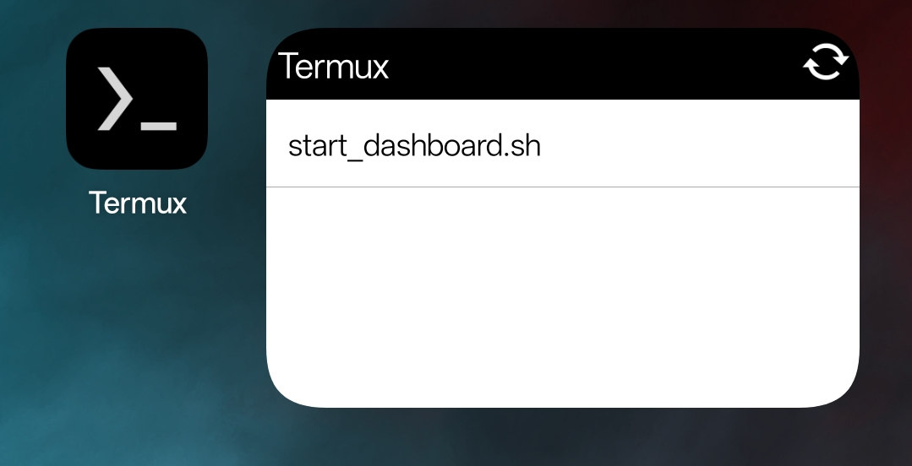

# Sol Wallet Dashboard

Sol Wallet Dashboard is a Flask-based application that allows users to monitor their Solana wallets, including balances in SOL and SPL tokens, and their total USD value. This app is designed to work seamlessly on Android devices through the Termux terminal.


---

Features

Track Wallet Balances: View SOL balances for multiple wallets.

Monitor SPL Tokens: Display SPL tokens held by wallets, including their USD value.

Dynamic Wallet Management: Add or remove wallets directly from the app.

Responsive Design: User-friendly dashboard viewable on mobile browsers.

Automatic USD Conversion: Convert SOL and SPL token balances into USD using live market data.


---

Prerequisites

Before you begin, ensure you have the following installed on your Android device:

Termux: Terminal emulator for Android.

Python: Installed via Termux.

Git: Installed via Termux.


---

Installation

Follow these steps to set up and run the Sol Wallet Dashboard:

1. Install Termux

Download and install Termux from the Play Store. 

Add the shortcut widget. 
 

---

2. Install Dependencies

Open Termux and run:

```
pkg update && pkg upgrade -y
pkg install python git -y
```

---
3. Setup ssh on termux for git

Termux doesn't allow password verification so you have to create a new ssh key on github for termux. Name the key Termux and run this command in Termux

```
ssh-keygen -t ed25519 -C "youremail@domain.com"
```

Make sure you use your github email. 

Then run this and copy the output into the "Termux" ssh key that you are making on github. 

```
cat ~/.ssh/id_ed25519.pub
```

Add the key. 

Test the connection. 

```
ssh -T git@github.com
```

4. Clone the Repository

Clone the repository to your local Termux environment:

```
git clone git@github.com:LeeLupton/sol_wallet_dashboard.git
```

Navigate into the project directory:

```
cd sol_wallet_dashboard
```

---

5. Install Python Requirements

Install the required Python libraries using:

```
pip install -r requirements.txt
```

---

6. Run the Application

Start the Flask server:

```
python app.py
```

The application will start and run on http://127.0.0.1:5000.


---

7. Open the Dashboard

1. Open your mobile browser (e.g., Chrome or Edge).


2. Enter the following URL:

```
http://127.0.0.1:5000
```


---

8. Add Wallets

Use the dashboard interface to add wallet names and their respective public addresses. The app will dynamically fetch and display balances for SOL and SPL tokens.


---

Automating Startup

To automate starting the server and opening the browser:

1. Create a script:

```
nano ~/.shortcuts/start_dashboard.sh
```

2. Add the following content:

```
#!/bin/bash
cd ~/sol_wallet_dashboard
python app.py &
sleep 2
am start -a android.intent.action.VIEW -d http://127.0.0.1:5000
```

3. Make the script executable:

```
cd ~/.shortcuts
```
```
chmod +x start_dashboard.sh
```

4. Run the script:

```
./start_dashboard.sh
```


---

Troubleshooting

Incorrect Wallet Balances: Ensure the wallet address is correct and active on the Solana blockchain.

Permission Denied for .shortcuts Directory:

Create the directory and set proper permissions:

```
mkdir -p ~/.shortcuts
chmod 700 ~/.shortcuts
```

API Errors: Check your Termux terminal for error logs. Verify the Solana API response.


---

Future Improvements

Implement wallet removal functionality.

Add support for additional blockchain networks.

Improve USD conversion accuracy for SPL tokens.

